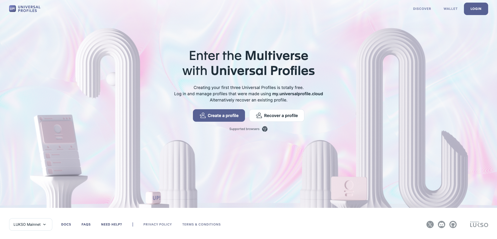

# Concepts & Glossary

## Universal Profile

A [Universal Profile](../standards/universal-profile/introduction.md) (UP) is a smart contract-based account that acts as the center for all your blockchain interactions. UPs, such as regular wallets, are generic for various use cases and can interact directly with on-chain applications. On top of that, they feature permission and asset management, updated profile information, and let you interact as one persona through different [controllers](#controller).

The [Universal Profile Browser Extension](/install-up-browser-extension) is the recommended way of interacting on LUKSO and managing Universal Profiles. The extension acts like a regular Ethereum wallet and uses the same `window.ethereum` object on [all supported browsers](/install-up-browser-extension). Alternatively, we endorse calling the equivalent `window.lukso` object. Developers can use their preferred libraries like [web3.js](https://web3js.readthedocs.io/) and [ethers.js](https://docs.ethers.org/) to interact with profiles like they do with other wallets.

When [connecting](https://docs.lukso.tech/learn/universal-profile/connect-profile.md) a profile, the extension automatically returns the address of the smart contract account. Similarly, the extension automatically verifies if the EOA controller has permission to [log-in](../learn/universal-profile/connect-profile/siwe.md) or [execute transfers](../learn/universal-profile/interactions/transfer-lyx.md).

:::info Using regular wallets

As LUKSO is an EVM-based blockchain, regular EOA wallets may be used for development. However, it is discouraged to use [EOAs](https://ethereum.org/en/developers/docs/accounts/#types-of-account) to onboard users, as they lack [all convenience features of LSPs](../faq/onboarding/lukso-standards.md#what-are-the-main-features-of-lsps). If you need a more general understanding of why we build our accounts on the smart contract level, we advise you to read about the [LUKSO Ecosystem](https://medium.com/lukso/lukso-ecosystem-part-1-4c3f5d67b081).

:::

## Profile Explorer & Management

To manage the Universal Profiles funds, set the recovery, check its monthly gas usage, or explore other blockchain accounts on the network, LUKSO provides [`universalprofile.cloud`](https://universalprofile.cloud). The platform acts as the entry point into the ecosystem and is split into two services:

- [`my.universalprofile.cloud`](https://my.universalprofile.cloud/): Create profiles and manage recovery
- [`wallet.universalprofile.cloud`](https://my.universalprofile.cloud/): Explore profiles and their assets

:::success External Integration

Developers can dock onto the explorer and reference profiles and assets. Using the `?network` parameter at the end of the URL, you can further define which LUKSO blockchain the asset data is fetched from.

- Profile: `wallet.universalprofile.cloud/<profile_address>?network=mainnet`
- Asset: `wallet.universalprofile.cloud/asset/<asset_address>?network=testnet`

:::

## Controller

Typically, every Universal Profile has a [Key Manager](../standards/universal-profile/lsp6-key-manager.md) to control the account's permissions. The term _"controller"_ refers to a permissioned address that can either be an [Externally Owned Account (EOA) or Smart Contract](https://ethereum.org/en/developers/docs/accounts/#types-of-account). When using the [Universal Profile Browser Extension](/install-up-browser-extension), the extension's EOA is set as the initial controller of the profile.

The [permissions](../standards/universal-profile/lsp6-key-manager.md#permissions) allow controllers to perform specific actions on the Universal Profile. The Key Manager then checks if the transaction from a calling address has the matching permission to be executed.

## Transaction Relay Service

The LUKSO blockchain has its native coin, LYX, used for gas fee payments to execute on-chain transactions. However, users on LUKSO do not need LYX to interact on the network. Instead of directly paying for the gas, users can send their signed transactions to a [Transaction Relay Service](../standards/relayer-api.md). The relay service will then execute the transaction on their behalf and cover the associated gas cost.

Payment to the relayer can be handled in different ways. One option is an on-chain payment where the fees are deducted directly from an on-chain balance. Alternatively, users can set up an off-chain agreement with the relayer service via a subscription model that gives them a monthly allowance for relayed transactions. This flexibility allows users to choose the method that best suits their needs.

On LUKSO, users currently get a free monthly quota of 20.000.000 GAS when creating a [Universal Profile](../standards/universal-profile/introduction.md) through the [Universal Profile Browser Extension](/install-up-browser-extension). For now, the onboarding is subsidized by LUKSO directly. In the future, multiple third parties will offer different relay services, evolving into a competitive relay ecosystem with various business models.
